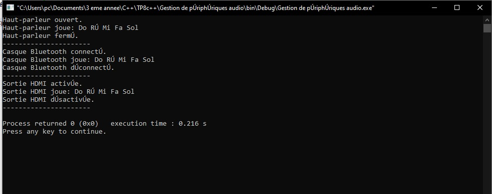
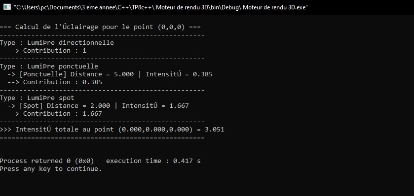
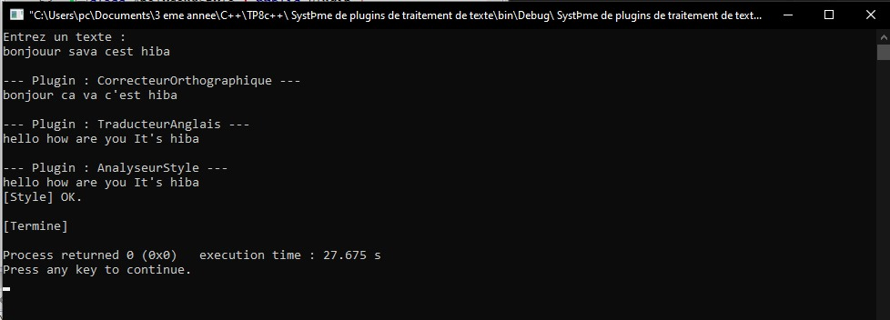

# TP8 — Polymorphisme et Classes Virtuelles en C++

##  Objectif général
Ce TP a pour but de comprendre et de mettre en œuvre le **polymorphisme** en C++ à travers l’utilisation de **classes abstraites**, de **méthodes virtuelles**, et de **pointeurs intelligents** (`std::unique_ptr`).  
Les exercices visent à illustrer :
- le comportement dynamique des classes dérivées via des pointeurs de la classe de base ;
- la gestion mémoire avec des destructeurs virtuels ;
- la flexibilité apportée par les interfaces abstraites.

---

##  Exercice 1 — Gestion de périphériques audio

###   Objectif
Simuler plusieurs périphériques audio (haut-parleur, casque Bluetooth, sortie HDMI) partageant la même interface.

###  Spécifications techniques
- Classe abstraite `SortieAudio` :
  - Méthodes virtuelles pures :
    ```cpp
    virtual void ouvrir() = 0;
    virtual void jouer(const std::string&) = 0;
    virtual void fermer() = 0;
    ```
  - Destructeur virtuel.
- Classes dérivées :  
  `HautParleur`, `CasqueBT`, `SortieHDMI`, chacune implémente ses propres versions.
- Fonction `tester(SortieAudio*)` :
  Appelle successivement `ouvrir()`, `jouer()`, puis `fermer()`.


Résultat visuel
<div align="center">  <p><em>Figure 1</em></p> </div>

##  Exercice 2 — Moteur de rendu 3D

### Objectif

Illustrer l’usage du polymorphisme pour simuler différents types de lumières 3D avec des calculs d’intensité distincts.

###  Spécifications techniques

Classe abstraite Lumiere avec méthode virtuelle pure :

virtual float intensite(const Vec3& position) = 0;


### Classes dérivées :

`LumiereDirectionnelle`

`LumierePonctuelle`

`LumiereSpot`

Chaque lumière calcule son intensité selon sa distance ou son angle.

Utilisation de std::unique_ptr<Lumiere> dans un std::vector.


### Résultat visuel
<div align="center">  <p><em>Figure 2</em></p> </div>

##  Exercice 3 — Système de plugins de traitement de texte
###  Objectif

Simuler un éditeur extensible où plusieurs plugins traitent un texte successivement.

###  Spécifications techniques

Classe abstraite Plugin :

`virtual string nom() const = 0;`
`virtual string traiter(const string&) = 0;`
`virtual ~Plugin() {}`
`static unique_ptr<Plugin> creerPlugin(const string& type);`


##  Trois plugins dérivés :

CorrecteurOrthographique (corrige des fautes simples)

TraducteurAnglais (traduit des mots de base)

AnalyseurStyle (analyse la longueur des phrases)

Le texte est transformé progressivement par chaque plugin.

### Résultat visuel
<div align="center">  <p><em>Figure 3</em></p> </div>
 
 ###  Environnement recommandé

Langage : C++17 ou supérieur

IDE : Code::Blocks, Visual Studio Code, CLion ou Dev-C++

Compilateur : g++ / clang++
